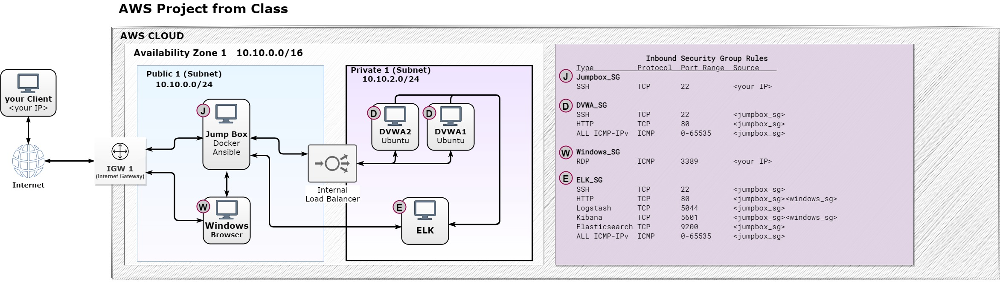
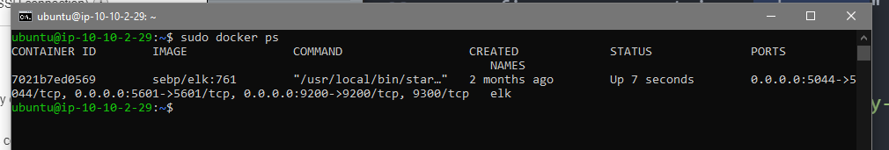

## Automated ELK Stack Deployment

The files in this repository were used to configure the network depicted below.



These files have been tested and used to generate a live ELK deployment on AWS. They can be used to either recreate the entire deployment pictured above. Alternatively, select portions of the _elk_config.yml_ file may be used to install only certain pieces of it, such as Filebeat.

  - _TODO: Enter the playbook file._
(./ansible/ansible_config.yml"Ansible")
(./ansible/elk_config.yml"ELK")
(./ansible/filebeat_config.yml"Filebeat")
(./ansible/metricbeat_config.yml"Metricbeat")

This document contains the following details:
- Description of the Topology
- Access Policies
- ELK Configuration
  - Beats in Use
  - Machines Being Monitored
- How to Use the Ansible Build


### Description of the Topology

The main purpose of this network is to expose a load-balanced and monitored instance of DVWA, the Damn Vulnerable Web Application.

Load balancing ensures that the application will be highly available, in addition to restricting access to the network.
- _What aspect of security do load balancers protect? What is the advantage of a jump box?_
> load balancers protect a network's availability by distributing workload to multiple machines

Integrating an ELK server allows users to easily monitor the vulnerable VMs for changes to the file system and system logs.
- _What does Filebeat watch for?_
>changes/other changes to the file system

- _What does Metricbeat record?_
> metrics about the machine it is hosted on, such as uptime, cpu usage, etc

The configuration details of each machine may be found below.
_Note: Use the [Markdown Table Generator](http://www.tablesgenerator.com/markdown_tables) to add/remove values from the table_.

| Name           | Function                                   | IP Addresses   | Operating System |
|----------------|--------------------------------------------|----------------|------------------|
| Jump Box       | Gateway                                    | 10.10.0.149    | Linux/Amazon     |
| ELK            | Log aggregation  & analysis                | 10.10.2.29     | Linux/Ubuntu     |
| DVWA (x2)      | Host Vulnerable web apps & use metricbeat, | 10.10.2.75     | Linux/Ubuntu     |
| ..             | filebeat to forward logs to ELK            | 10.10.2.32     | ..               |
| Windows Client | access ELK Server via browser              | 10.10.0.116    | Windows          |

### Access Policies

The machines on the internal network are not exposed to the public Internet.

Machines within the network can only be accessed by the Jump Box.
- _Jump Box Internal IP(10.10.0.149)_

A summary of the Security Groups effecting the network is illustrated below.

| Name       | inbound rules                                                         |
|------------|-----------------------------------------------------------------------|
| ELK_SG     | 80/HTTP 22/SSH all/ICMP 5044/Logstash                                 |
|            | 55600/Kibana 9200/Elasticsearch                                       |
| Windows_SG | 3389/RDP all/ICMP                                                     |
| DVWA_SG    | 80/HTTP 22/SSH all/ICMP                                               |
| Windows_SG | 3389/RDP all/ICMP                                                     |
| Jumpbox    | 22/SSH                                                                |

**allowed inbound sources can be viewed in the diagram above

### Elk Configuration

Ansible was used to automate configuration of the ELK machine. No configuration was performed manually, which is advantageous because...
- _What is the main advantage of automating configuration with Ansible?_
>configuration may be quick and trivial on a small network. However, as a network grows the workload (time and brainpower) of maintaining it. automation removes the potentially time consuming and expensive process of deploying & configuring each machine manually._

The playbook implements the following tasks:
- _TODO: In 3-5 bullets, explain the steps of the ELK installation play. E.g., install Docker; download image; etc._
- update the jumpbox machine then download & install docker
```
sudo yum update
sudo yum upgrade
sudo yum install docker -y
```
- configure the daemon.json file
```
sudo nano /etc/docker/daemon.json
```
```
{
 “default-address-pools”:
 [
 {“base”:”10.10.0.0/16”,”size”:24}
 ]
{
```
- start docker
```
sudo service docker start
```
- download & run the docker container for Ansible
```
sudo docker pull cyberxsecurity/ansible
sudo docker images #check that it is installed/available
sudo docker run -ti cyberxsecurity/ansible bash

```
this will open a bash terminal into your new instance of an ansible container.
- configure your container webservers"  
- open another bash terminal and SSH back into the jumpbox, then copy the key.pem and install-elk.yml files into the docker container
```
sudo docker cp key.pem <container_id>:/root
sudo docker cp install-elk.yml <container_id>:/root
```
```
nano /etc/ansible/hosts
```
find the line that reads '[webservers]' and enter the following three lines
```
[dvwa]
10.10.2.75
10.10.2.35
[elk]
10.10.2.29
```
NOTE: entering the IP for the elk group will now will save time later.
```
ansible-playbook elk_config.yml --key-file=<key.pem>
```
this will attempt to install Elk on the 'dvwa' group in the install-elk.yml file
```
sudo docker run -p 5601:5601 -p 9200:9200 -p 5044:5044 -it --name elk sebp/elk
```

The following screenshot displays the result of running `docker ps` after successfully configuring the ELK instance.



### Target Machines & Beats
- This ELK server is configured to monitor the following machines:
>  10.10.2.75, 10.10.2.32

- We have installed the following Beats on these machines:
> Filebeat, Metricbeat

- These Beats allow us to collect the following information from each machine:
>Filebeat monitors the log files, collects log events then forwards that data to Logstash.

>metricbeat collects metric data about it's host. metrics gathered from alerts based on data such as RAM usage can alert SOC analysts when machines on a network are acting abnormally.

### Using the Playbook
In order to use the playbook, you will need to have an Ansible control node already configured. Assuming you have such a control node provisioned:

SSH into the control node and follow the steps below:
- Copy the playbook file(s) their respective jumpbox(es).
- if you haven't already, Update the hosts file to the IP addresses of the DVWA1 & 2 machines and ELK
- Run the playbook
```
ansible-playbook <playbook_file.yaml --key-file <key.pem>
```

### Answer the following questions to fill in the blanks:_
- Which file is the playbook? Where do you copy it?_
> the playbook files are labelas as <ansible/elk/filebeat/metricbeat>_config.yml. they should be copied into jumpbox, elk, dvwa1&2, dvwa1&2 respectively.
```
sudo docker cp <key.pem> <container id>:/root
```

- Which file do you update to make Ansible run the playbook on a specific machine? How do I specify which machine to install the ELK server on versus which to install Filebeat on?_
> #jumbox
/etc/ansible/hosts
